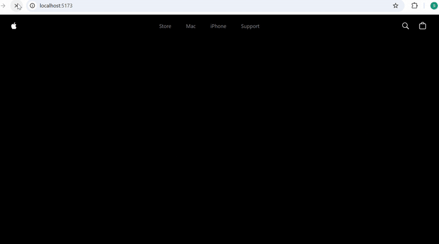
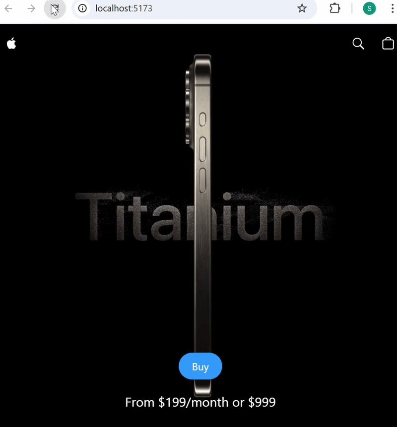
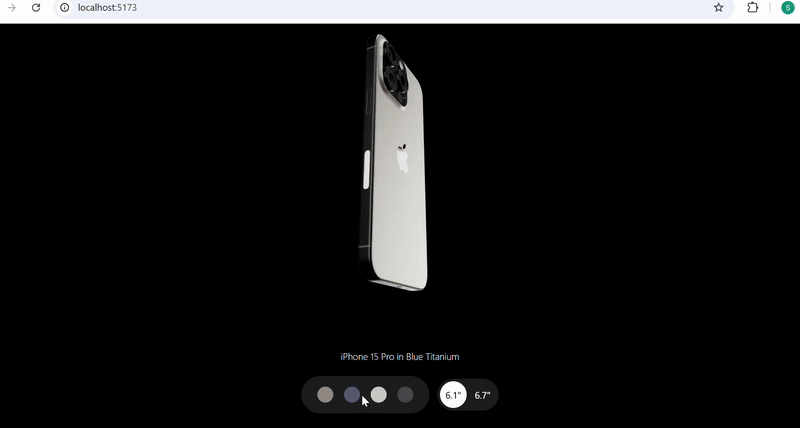
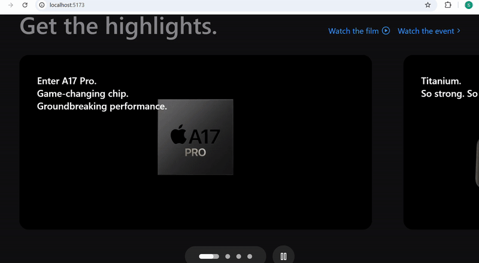

# Apple's Landing Page Clone

A high-fidelity clone of Apple's iPhone 15 Pro landing page, built with **React, Three.js, and GSAP** to deliver smooth animations, interactive 3D models, and a pixel-perfect responsive design.

## Project Preview

| Desktop View | Mobile View |
|--------------|-------------|
|  |  |

| 3D Model Interaction | Video Carousel |
|----------------------|----------------|
|  |  |


## Features

- **GSAP Animations** – Smooth scroll-triggered transitions for a premium feel.
- **Video Carousel** – Dynamic GSAP-powered video showcase.
- **3D iPhone Model** – Interactive, rotatable iPhone 15 Pro with color/size options (React Three Fiber + Drei).
- **Fully Responsive** – Optimized for mobile, tablet, and desktop.

## Tech Stack

- **Frontend**: React (Vite)
- **3D Rendering**: Three.js, React Three Fiber, React Three Drei
- **Animations**: GSAP (Greensock)
- **Styling**: Tailwind CSS


## Quick Start

1. **Clone the repository**
   ```sh
   git clone https://github.com/sanMakesApps/iphone-lp-clone.git
   cd iphone-lp-clone

2. **Install dependencies**
   ```sh
   npm install

3. **Run the dev server**
   ```sh
   npm run dev

## Learning Goals

- **Three.js/React Three Fiber** - 3D rendering pipeline, model controls.
- **GSAP** - Timeline-based animations, scroll triggers.
- **Tailwind** - Utility-first responsive design.
